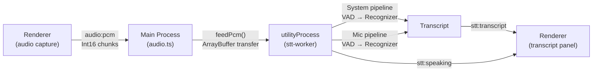

# Phase 2 — Local Live Transcription Walkthrough

## Summary

Phase 2 adds **fully offline, local speech-to-text** to the Cluely overlay. System audio is transcribed and labeled **Them**, microphone audio is labeled **You**. Inference runs in a separate Electron `utilityProcess` so the overlay stays responsive.

## Architecture

## Files Changed

### New Files (5)

| File | Purpose |
|------|---------|
| [stt-worker.ts](file:///d:/Cluely/overlay/src/main/stt-worker.ts) | utilityProcess entry — dual `{Silero VAD + OfflineRecognizer}` pipelines |
| [stt.ts](file:///d:/Cluely/overlay/src/main/stt.ts) | Worker lifecycle, PCM routing, transcript relay to renderer |
| [stt.d.ts](file:///d:/Cluely/overlay/src/preload/stt.d.ts) | Type declarations for `window.stt` + `Transcript` shape |
| [panel.ts](file:///d:/Cluely/overlay/src/renderer/transcript/panel.ts) | Transcript panel renderer with in-memory store |
| [.gitignore](file:///d:/Cluely/overlay/.gitignore) | Ignores `models/`, `node_modules/`, `out/`, `dist/` |

### Modified Files (8)

| File | Changes |
|------|---------|
| [config.ts](file:///d:/Cluely/overlay/src/main/config.ts) | Added `STT` config block, `resolveModelPath()`, `WINDOW_HEIGHT: 620` |
| [audio.ts](file:///d:/Cluely/overlay/src/main/audio.ts) | Added `feedPcm()` call in `audio:pcm` handler |
| [index.ts](file:///d:/Cluely/overlay/src/main/index.ts) | Added `startStt(win)` in `whenReady`, `stopStt()` in `will-quit` |
| [preload/index.ts](file:///d:/Cluely/overlay/src/preload/index.ts) | Added `window.stt` API (onTranscript, onSpeaking, onReady, onError, clear) |
| [index.html](file:///d:/Cluely/overlay/src/renderer/index.html) | Added transcript pane section with STT status badge |
| [style.css](file:///d:/Cluely/overlay/src/renderer/style.css) | Added 175 lines of transcript/speaking indicator styling |
| [renderer.ts](file:///d:/Cluely/overlay/src/renderer/renderer.ts) | Wired `window.stt` events to transcript panel |
| [electron.vite.config.ts](file:///d:/Cluely/overlay/electron.vite.config.ts) | Added `stt-worker` as separate Rollup entry |
| [electron-builder.yml](file:///d:/Cluely/overlay/electron-builder.yml) | Added `asarUnpack` for sherpa-onnx-node + `extraResources` for models |
| [tsconfig.web.json](file:///d:/Cluely/overlay/tsconfig.web.json) | Added `stt.d.ts` to include list |

### Models Downloaded

| File | Size | Purpose |
|------|------|---------|
| `models/silero_vad.onnx` | 644 KB | Silero VAD v4 |
| `models/sherpa-onnx-nemo-parakeet-tdt-0.6b-v2-int8/encoder.int8.onnx` | 652 MB | Parakeet encoder |
| `models/sherpa-onnx-nemo-parakeet-tdt-0.6b-v2-int8/decoder.int8.onnx` | 7.3 MB | Parakeet decoder |
| `models/sherpa-onnx-nemo-parakeet-tdt-0.6b-v2-int8/joiner.int8.onnx` | 1.7 MB | Parakeet joiner |
| `models/sherpa-onnx-nemo-parakeet-tdt-0.6b-v2-int8/tokens.txt` | 9 KB | Token vocabulary |

## Validation Results

- ✅ TypeScript builds clean (`npm run build`)
- ✅ `npm run dev` starts successfully
- ✅ STT worker forks and initializes both pipelines
- ✅ Model paths resolve correctly in dev mode
- ✅ Worker reports "ready" after loading models
- ✅ Resolved AudioWorklet loading error: Fixed by setting `publicDir` for the renderer in [electron.vite.config.ts](file:///d:/Cluely/overlay/electron.vite.config.ts), ensuring `pcm-worklet.js` is served during development and copied during builds.
- ✅ Resolved VAD method call error: Fixed by changing the call from `isSpeechDetected()` to `isDetected()` in [stt-worker.ts](file:///d:/Cluely/overlay/src/main/stt-worker.ts) to match the actual native API exported by `sherpa-onnx-node`.
- ✅ Resolved postMessage transferable port error: Fixed by removing the transferable array from `worker.postMessage()` in [stt.ts](file:///d:/Cluely/overlay/src/main/stt.ts) since Electron's `utilityProcess.postMessage` only permits transferring `MessagePort`s, and the `ArrayBuffer` is automatically cloned by the structural cloning algorithm.
- ✅ Resolved VAD segment front retrieval error: Fixed by passing `false` to `pipeline.vad.front(false)` in [stt-worker.ts](file:///d:/Cluely/overlay/src/main/stt-worker.ts) because the native library wrapper throws `External buffers are not allowed` under the default config.

## Manual Testing (Your Turn)

The app is running. Please verify these Phase 2 acceptance criteria:

1. **System capture → "Them"**: Turn on System, play a video/clip → text appears under Them within ~1–2s of pauses
2. **Mic → "You"**: Turn on Mic, speak → text appears under You
3. **Both at once**: Enable both → two correctly-labeled streams
4. **Offline**: Disconnect network → transcription continues
5. **Responsive**: Drag overlay and use hotkeys while transcribing → no freeze
6. **Long speech**: Speak >10s without pause → not truncated (`maxSpeechDuration: 20`)

> [!TIP]
> The STT status badge next to "Live Transcript" should show **"ready ✓"** in green once the models have loaded.

