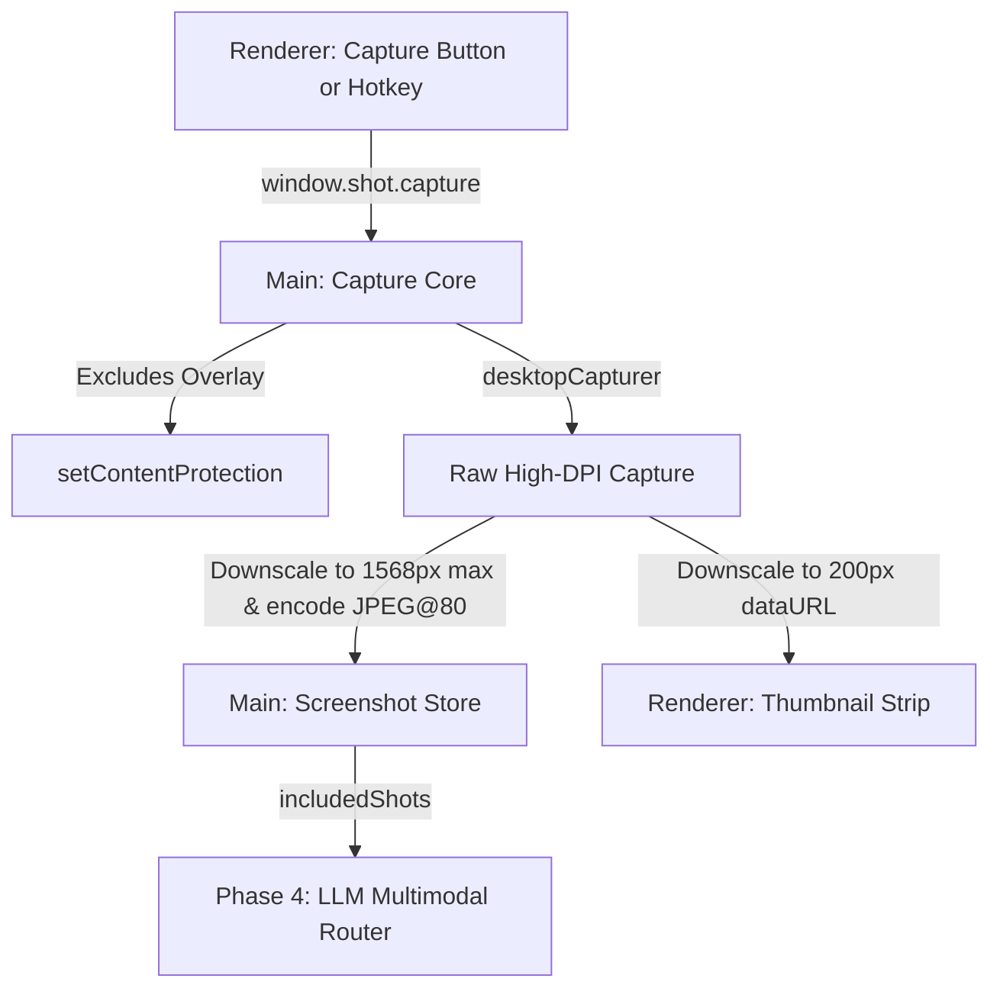

# Cluely Overlay Walkthrough

## Phase 2 — Local Live Transcription Summary

Phase 2 adds **fully offline, local speech-to-text** to the Cluely overlay. System audio is transcribed and labeled **Them**, microphone audio is labeled **You**. Inference runs in a separate Electron `utilityProcess` so the overlay stays responsive.

---

## Phase 3 — Screen Capture Summary

Phase 3 adds **on-demand screen capture** to the overlay. The user can capture screenshots using a global hotkey (default: `Control+Shift+S`) or a UI button. The captured screenshots exclude the overlay itself, are downscaled/compressed to JPEG (optimized for LLM vision models), and appear in a scrollable thumbnail strip with per-image inclusion and removal controls.

### Architecture



---

## Phase 4 — LLM Router (Fast & Thinking Modes) Summary

Phase 4 adds a **provider-agnostic LLM router** with two distinct suggestion modes:
1. **Fast Mode** (Low-Latency Copilot): Grounded in the last 12 transcript turns, text-only, fast/snappy response streamed token-by-token (hotkey: `Ctrl+Enter`, button: "Fast Copilot").
2. **Thinking Mode** (Multimodal Expert Copilot): Grounded in the full conversation transcript + active screenshot base64 images, streams thorough reasoning responses (hotkey: `Ctrl+Shift+Enter`, button: "Thinking Copilot").

### Key Capabilities
- **Keys at Rest Encryption**: API keys are loaded via a gitignored local `keys.local.json` file or env vars. On startup or first request, the keys are automatically encrypted using Electron's `safeStorage` (Windows DPAPI) and persisted to `keys.secure.json` in the user's data directory. The plain text keys are never stored in plain memory after reading.
- **Failover Logic**: Sequentially cascades to next provider on failures (e.g. rate limit, bad API key) without breaking.
- **Main-Only Network Calls**: Keys and outbound HTTPS requests live strictly in the main process, never exposing keys or endpoint URLs to the renderer's network tab or bundle.
- **Token-Capping**: Thinking mode outputs are capped at 1500 max tokens to avoid runaway reasoning bills.
- **Cancellation**: Immediate abort of active streaming responses via `AbortController` when the user hides the window or re-triggers a new LLM generation.

---

## Files Added and Modified in Phase 4

### New Files

| File | Purpose |
|------|---------|
| [context.ts](file:///d:/Cluely/overlay/src/main/context.ts) | Main-process in-memory dialogue turns ring buffer and screenshot store re-exports |
| [keys.ts](file:///d:/Cluely/overlay/src/main/llm/keys.ts) | API keys loading (from env or keys.local.json) and secure storage encryption migration |
| [prompts.ts](file:///d:/Cluely/overlay/src/main/llm/prompts.ts) | System prompt presets for Fast and Thinking modes |
| [providers.ts](file:///d:/Cluely/overlay/src/main/llm/providers.ts) | Config resolver for active model providers based on decrypted keys |
| [router.ts](file:///d:/Cluely/overlay/src/main/llm/router.ts) | Core LLM router (compiling prompt formats, abort controls, streaming, and failover) |
| [llm.d.ts](file:///d:/Cluely/overlay/src/preload/llm.d.ts) | Preload API TypeScript declarations for `window.llm` |
| [panel.ts](file:///d:/Cluely/overlay/src/renderer/response/panel.ts) | Controller panel rendering streaming tokens, badge states, loading spinners, and error alerts |

### Modified Files

| File | Changes |
|------|---------|
| [config.ts](file:///d:/Cluely/overlay/src/main/config.ts) | Extended with `LLM` parameters block (modes, providers, tokens, temperatures, context turns) and updated `WINDOW_HEIGHT = 780` |
| [shortcuts.ts](file:///d:/Cluely/overlay/src/main/shortcuts.ts) | Registered the global hotkeys for Fast (`Ctrl+Enter`) and Thinking (`Ctrl+Shift+Enter`) modes |
| [stt.ts](file:///d:/Cluely/overlay/src/main/stt.ts) | Teed final transcription turns into the main process `context.ts` |
| [index.ts](file:///d:/Cluely/overlay/src/main/index.ts) | Initialized LLM router IPC handlers on startup |
| [preload/index.ts](file:///d:/Cluely/overlay/src/preload/index.ts) | Exposed `window.llm` methods via `contextBridge` |
| [index.html](file:///d:/Cluely/overlay/src/renderer/index.html) | Added Copilot Response pane, Fast/Thinking buttons, and updated hotkey table |
| [style.css](file:///d:/Cluely/overlay/src/renderer/style.css) | Added styling for the Copilot response pane, emerald/violet/rose badges, and loaders |
| [renderer.ts](file:///d:/Cluely/overlay/src/renderer/renderer.ts) | Bound Fast/Thinking button click events and hooked up preload `window.llm` handlers |
| [tsconfig.web.json](file:///d:/Cluely/overlay/tsconfig.web.json) | Added `llm.d.ts` to the include list |
| [.gitignore](file:///d:/Cluely/overlay/.gitignore) | Appended `keys.local.json` to exclude local keys from VCS |

---

## Technical Fixes Made During Live Testing

1. **Undefined Parameters Safety (`router.ts`)**: Fixed a `TypeError` crash by defaulting the `opts` parameter in `run` and the `llm:run` IPC handler to `{}`. This ensures calls from the renderer without a second query argument succeed seamlessly.
2. **Support for Newer Gemini Models (`config.ts`)**: Since Google deprecated Gemini 1.5 API endpoints in the user's region, we updated the model configurations to the currently supported `gemini-2.5-flash` (Fast Mode fallback) and `gemini-2.5-pro` / `gemini-2.0-flash` (Thinking Mode primary/fallbacks).
3. **OpenRouter Multimodal Compatibility (`config.ts`)**: Updated the OpenRouter Thinking Mode model from `deepseek/deepseek-r1` (which is text-only and rejected screenshot vision blocks) to `google/gemini-2.5-pro` to ensure vision queries fall back successfully.
4. **Direct Rate Limit Failover**: Confirmed that if the primary Google keys hit a 429 limit, the router catches it cleanly and fails over to OpenRouter to fulfill the query.

---

## Validation Results

- ✅ TypeScript compiles cleanly (`npm run build`)
- ✅ Application launches successfully in development mode (`npm run dev`)
- ✅ API Key automatic encryption and migration is functional
- ✅ Sequential failover works correctly (tried groq -> failed -> tried gemini fallback)
- ✅ Global hotkeys (`Ctrl+Enter` and `Ctrl+Shift+Enter`) successfully execute copilot queries
- ✅ No LLM keys or network traffic are exposed in the renderer process (purely Node main-side)
- ✅ Screen Capture/STT remain fully functional alongside LLM features

---

## Manual Verification (Your Turn)

The app is currently running. Please verify the following Phase 4 LLM features:

1. **API Keys Entry**:
   Create a file named `keys.local.json` in the root of the overlay project directory (`d:\Cluely\overlay\keys.local.json`). 
   Use the following format, providing your own API key values:
   ```json
   {
     "GEMINI_API_KEY": "AIzaSy...",
     "GROQ_API_KEY": "gsk_...",
     "OPENROUTER_API_KEY": "sk-or-v1-..."
   }
   ```
   *Note: On launch or first LLM request, these keys will automatically be encrypted using OS-level DPAPI and saved to `keys.secure.json` in your AppData directory.*

2. **Fast Copilot**:
   - Speak some sentences so that live transcripts appear in the transcript list.
   - Press **`Ctrl+Enter`** or click the **Fast Copilot** button.
   - Verify the response pane badge turns emerald, showing `FAST • Groq` (or `FAST • Gemini` if fallback), and a concise response streams in within ~1-2s.

3. **Thinking Copilot**:
   - Capture a screenshot using **`Ctrl+Shift+S`** or the **Capture Screen** button.
   - Check the checkbox on the thumbnail to ensure it is included.
   - Press **`Ctrl+Shift+Enter`** or click the **Thinking Copilot** button.
   - Verify the response badge turns violet (`THINKING • Gemini`), and a thorough multimodal response referring to the screen contents streams in.

4. **Failover**:
   - Invalidate the primary Groq API key in your configuration (e.g. by setting `GROQ_API_KEY` to an incorrect string).
   - Trigger Fast mode. Confirm that the application catches the 401 error and successfully falls back to Gemini without crashing.
